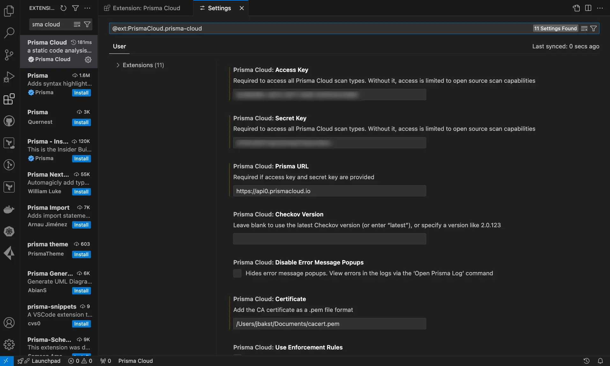

# Prisma Cloud VSCode Plugin

## Overview
The Prisma Cloud VSCode Plugin seamlessly integrates Prisma Cloud's security checks into your Visual Studio Code environment. This plugin provides real-time feedback on potential security issues as you write code, ensuring that security is prioritized throughout the development process.

With the Prisma Cloud VSCode Plugin, developers can conveniently access features such as vulnerability scanning, code remediation, and policy enforcement directly within their coding workflow. Additionally, the plugin detects Infrastructure as Code (IaC) misconfigurations in templates like Kubernetes and Terraform, scans for Software Composition Analysis (SCA) vulnerabilities, identifies secrets vulnerabilities, and ensures compliance with software licensing requirements.

Policies and enforcement rules can be centrally managed within Prisma Cloud, providing a streamlined approach to security management across your organization's development projects.

## Features
- **IaC Misconfigurations**: Detect misconfigurations in IaC templates (e.g., Kubernetes, Terraform).
- **SCA Vulnerabilities**: Identify security issues in open-source dependencies.
- **Secrets Detection**: Uncover vulnerabilities related to stored secrets.
- **License Compliance**: Ensure adherence to software licensing requirements.

## Installation
To install the Prisma Cloud VSCode Plugin, follow these steps:
1. Open Visual Studio Code.
2. Navigate to the Extensions view by clicking on the square icon in the sidebar or pressing `Ctrl+Shift+X`.
3. Search for "Prisma Cloud" in the Extensions view search bar.
4. Click on the Prisma Cloud extension in the search results.
5. Click the "Install" button.

## Configuration

To adjust the Prisma Cloud VSCode Plugin settings, follow these steps:

1. Open Visual Studio Code.
2. Navigate to the extension settings by clicking on the gear icon in the sidebar or pressing `Ctrl+,`.
3. Find the 'Prisma Cloud' extension settings.
4. Update the following fields:
   - **Access Key**: The Prisma Cloud access key ID
   - **Secret Key**: The Prisma Cloud secret key
   - **Prisma URL**: Your Prisma URL e.g. `https://api.prismacloud.io`.
   - **Checkov version**: Leave blank to use the latest Checkov version (or enter 'latest'), or specify a version like 2.0.123
   - **Suppress Error Popups**: Hide error message popups
   - **External checks dir**: Provide the path to a folder containing custom security checks
   - **Skip SSL Verification**: Bypass SSL certificate verification for troubleshooting purposes in test environments ONLY. This is highly discouraged in production environments as it exposes you to potential security risks, since invalid and falsified certificates will not be detected
   - **Specific Frameworks**: Scan specific frameworks such as arm json secrets serverless. You can add multiple frameworks using spaces between the values in the command. Refer to [Checkov CLI Command Reference](https://www.checkov.io/2.Basics/CLI%20Command%20Reference.html) for more information
   - **CA-Certificate**: Add the CA certificate. Format: .pem file
   - **Use Enforcement Rules**: Enforce soft-fail thresholds set by Enforcement apply for VS Code scans
   Hard-fail and comment bot are not supported by the IDE. For more information on Enforcement, refer to the [Enforcement documentation](https://docs.prismacloud.io/en/enterprise-edition/content-collections/application-security/risk-management/monitor-and-manage-code-build/enforcement)
   - **SAST Full Scan Size Limit**: Set a threshold (in MB), above which SAST scans will not run on a repository. This setting is currently available for Beta customers only.

## Usage
Once configured, you can start using the Prisma Cloud VSCode Plugin to enhance your development workflow:
1. Write your code as usual.
2. The plugin will provide real-time feedback and security suggestions as you work.
3. Use the provided actions and commands to address security issues and ensure compliance with best practices.

## Additional Resources
- [Prisma Cloud Documentation](https://docs.prismacloud.io/en/enterprise-edition/content-collections/application-security/ides/connect-vscode): Additional information and documentation on using the Prisma Cloud VSCode Plugin.

